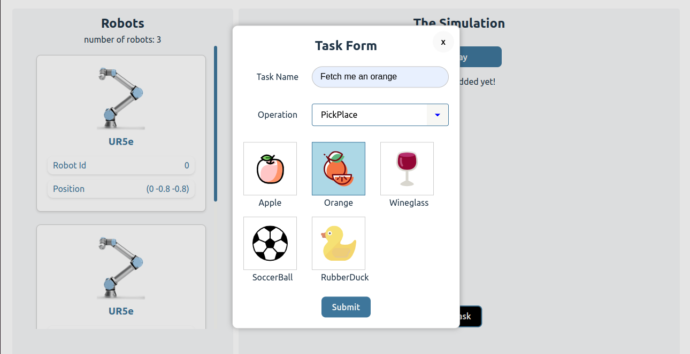
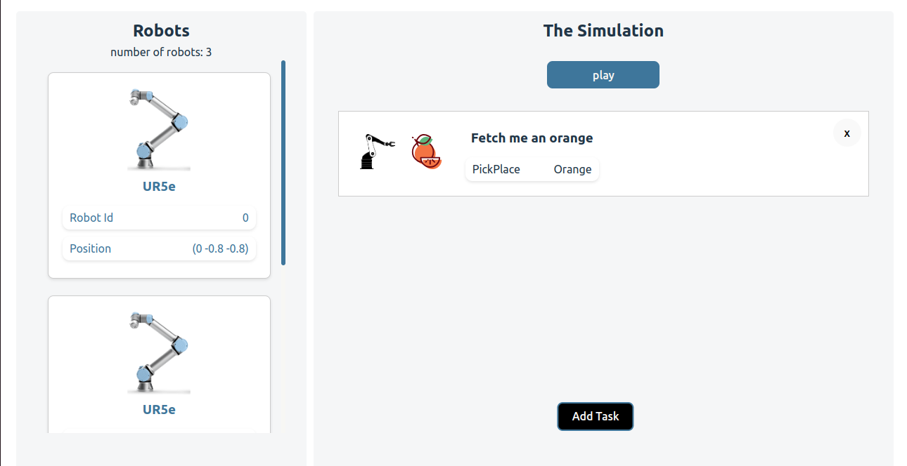
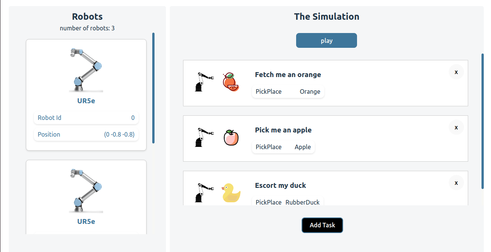

# simulation_interface
An interface that connects to the WebotsAPI for the [Human-Robot Collaboration Simulation](https://github.com/madaooftheblues/webots-worlds) project.

## Visuals
- main

- add task

- task

- task list

